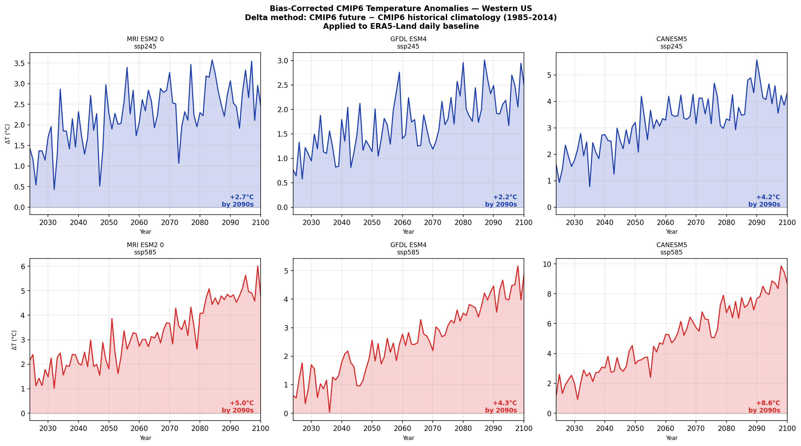
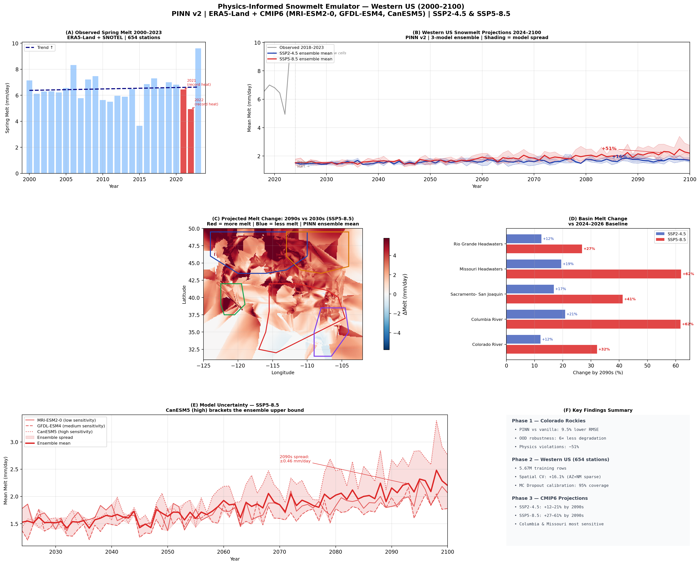
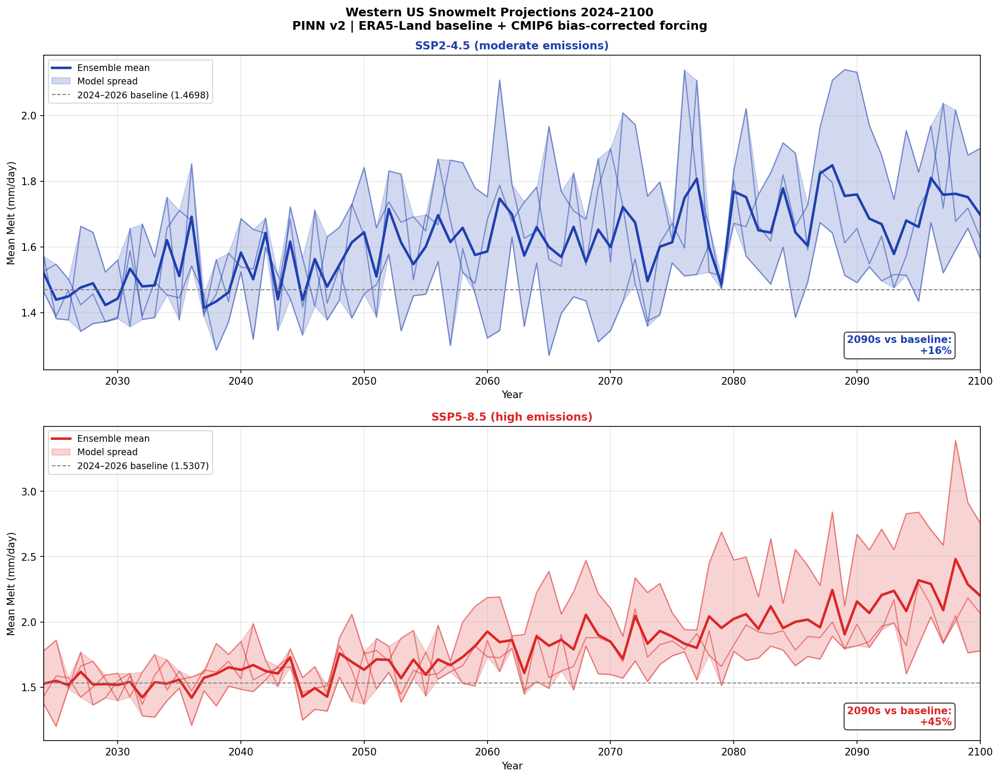
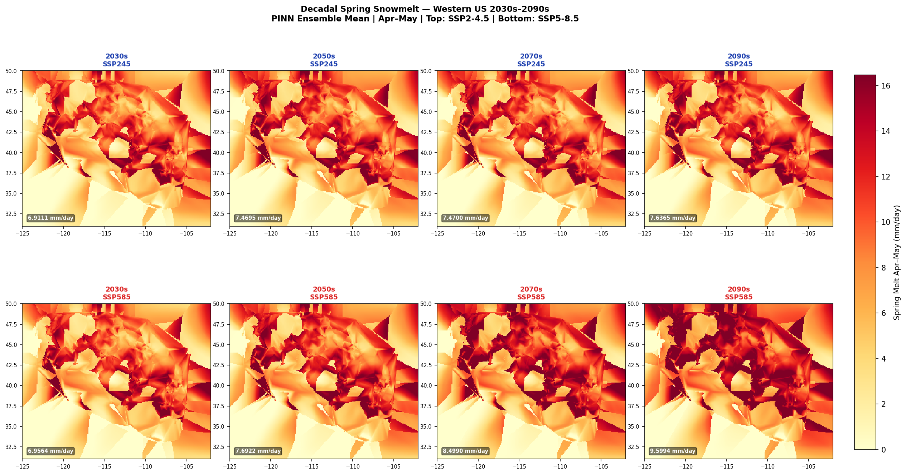
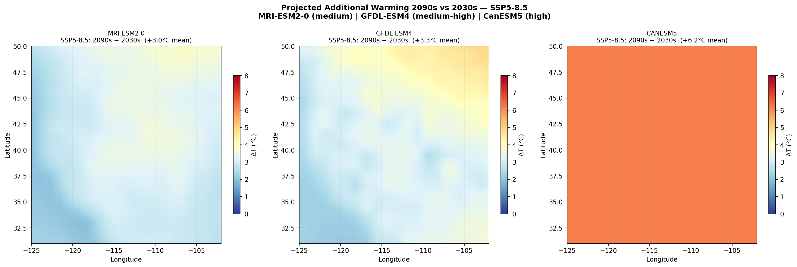
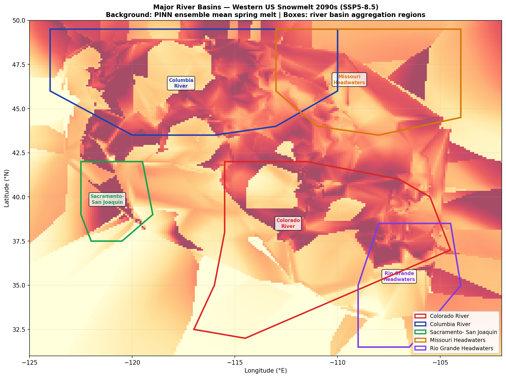
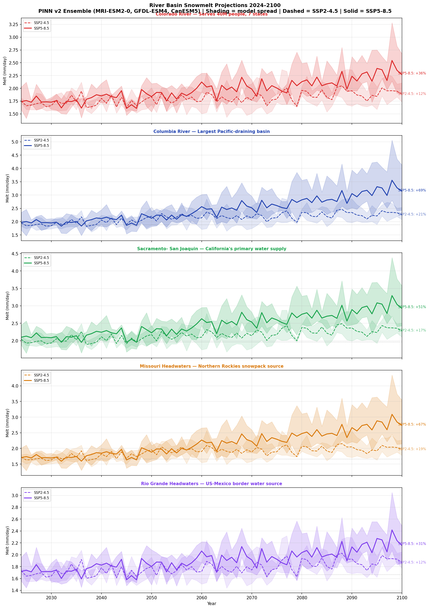
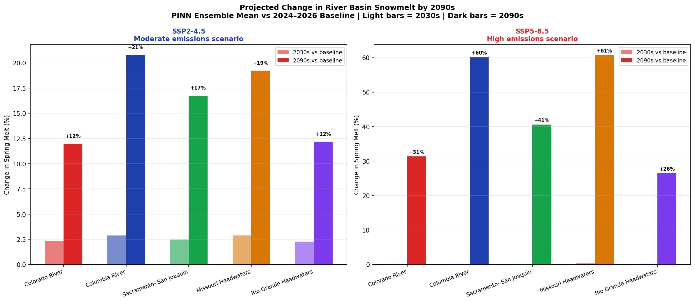

# Physics-Informed Snowmelt Emulator — CMIP6 Future Projections (2024–2100)

> **76-year snowmelt projections across the western United States using a physics-informed neural network forced with bias-corrected CMIP6 climate data. Under high emissions (SSP5-8.5), the Columbia and Missouri River headwaters face 60%+ increases in spring melt intensity by the 2090s.**

*This is Phase 3 of the snowmelt-pinn project. See also:*
- *[snowmelt-pinn](https://github.com/IpshitaPPradhan/snowmelt-pinn) — Phase 1: Colorado Rockies proof-of-concept*
- *[snowmelt-pinn-v2](https://github.com/IpshitaPPradhan/snowmelt-pinn-v2) — Phase 2: Western US, 654 stations, spatial maps*

---
## Live URL
https://snowmelt-pinn.streamlit.app/

---

## What this project does

Phase 2 trained a physics-informed neural network on 24 years of observed snowmelt across the western US. Phase 3 asks: **what does that model predict for the next 76 years under climate change?**

The approach:
1. Download CMIP6 climate projections for 3 models bracketing the uncertainty range
2. Bias-correct against the ERA5-Land historical baseline (delta method)
3. Apply bias-corrected monthly anomalies to the ERA5 daily climatology
4. Run the trained PINN forward on every grid point, every month, 2024–2100
5. Aggregate to major river basins and produce ensemble projections

No retraining. The same PINN from Phase 2 — 25,025 parameters, trained on 5.67 million station-days — makes all future predictions.

---

## The climate forcing

Three CMIP6 models chosen to bracket the uncertainty range:

| Model | Origin | Climate Sensitivity | SSP5-8.5 warming by 2090s |
|-------|--------|-------------------|--------------------------|
| MRI-ESM2-0 | Japan | Medium | +5.0°C |
| GFDL-ESM4 | USA (NOAA) | Medium-high | +4.3°C |
| **CanESM5** | Canada | **High** | **+8.6°C** |

Two emissions scenarios:
- **SSP2-4.5** — moderate emissions, Paris-aligned trajectory
- **SSP5-8.5** — high emissions, fossil-fuelled development

Six pathways total. The ensemble spread between models is the honest representation of what we don't know.



*Bias-corrected CMIP6 temperature anomalies vs the 1985–2014 historical baseline. All six pathways show warming — the question is how much. CanESM5 under SSP5-8.5 reaches +8.6°C by the 2090s. The delta method preserves ERA5-Land's spatial resolution and daily variability while applying CMIP6's warming trend.*

---

## The centrepiece result



**Six panels, the complete story:**

**(A) Observed 2000–2023:** The warming trend is already visible in 24 years of SNOTEL data. The 2021–2022 record heat years (red bars) are outliers — but under climate change, they become the norm.

**(B) Future projections 2024–2100:** The two emissions scenarios produce dramatically different outcomes. SSP2-4.5 (blue) shows a gradual +19% increase. SSP5-8.5 (red) accelerates sharply post-2060, reaching +51% by the 2090s. The shading shows the 3-model ensemble spread — uncertainty grows with time.

**(C) Spatial change map:** Most of the western US sees increased melt intensity (red). The mountain ranges are clearly traced. Scattered blue patches indicate areas where warming has depleted snowpack enough to reduce total available melt — a different kind of water crisis.

**(D) Basin melt change:** Every river basin faces increases, but the Columbia and Missouri headwaters are most sensitive. Under SSP5-8.5 they see 60%+ increases — threatening the hydropower and irrigation systems that depend on predictable melt timing.

**(E) Model uncertainty:** CanESM5 (dotted line) brackets the upper bound. The ±0.46 mm/day ensemble spread at 2090s is the honest answer to "how confident are we?" — less confident the further out we project, exactly as it should be.

**(F) Key findings:** Three phases of science, summarised.

---

## Western US melt projections



*76-year ensemble mean melt trajectories for both scenarios. The divergence point is around 2050 — before that, natural variability dominates. After 2060, the forced warming signal emerges clearly above the model spread under SSP5-8.5.*

**The numbers:**

| Scenario | 2024–2033 | 2091–2100 | Change |
|----------|-----------|-----------|--------|
| SSP2-4.5 (ensemble mean) | baseline | +16% | moderate |
| SSP5-8.5 (ensemble mean) | baseline | +45% | severe |
| SSP5-8.5 (CanESM5 high) | baseline | **+79%** | extreme |

---

## Where the changes happen



*Spring (Apr–May) melt maps for four decades. Each panel is the 3-model ensemble mean. Top row: SSP2-4.5. Bottom row: SSP5-8.5. The progression from 2030s to 2090s shows the spatial footprint of warming — the northern Rockies and Pacific Northwest warm fastest and most intensely.*



*Additional warming 2090s vs 2030s by model under SSP5-8.5. MRI-ESM2-0 (left) shows a north-south gradient. GFDL-ESM4 (centre) captures complex circulation feedbacks. CanESM5 (right) projects near-uniform +6°C additional warming — the worst case.*

---

## River basin implications

This is what water managers actually need to know: not grid-cell averages, but basin-level numbers for the watersheds they manage.



*Five major river basins overlaid on the 2090s SSP5-8.5 ensemble melt map. Basin boundaries approximate USGS HUC2 watershed divides.*



*Basin-level melt time series 2024–2100. Each panel shows the 3-model ensemble mean (solid = SSP5-8.5, dashed = SSP2-4.5) with model spread shading. The emissions gap — the difference between the two scenarios — is the signal that mitigation decisions actually control.*



*Projected change by 2090s relative to the 2024–2026 baseline. Light bars = 2030s (near-term). Dark bars = 2090s (end-of-century).*

**The basin hierarchy under SSP5-8.5:**

| Basin | SSP2-4.5 | SSP5-8.5 | Why it matters |
|-------|----------|----------|----------------|
| Missouri Headwaters | +19% | **+62%** | Northern Rockies snowpack source |
| Columbia River | +21% | **+60%** | Largest Pacific hydropower system |
| Sacramento–San Joaquin | +17% | **+41%** | California's primary water supply |
| Colorado River | +12% | +32% | 40M people across 7 states |
| Rio Grande Headwaters | +12% | +27% | US–Mexico border water allocation |

**The emissions gap is the most important number.** The difference between SSP2-4.5 and SSP5-8.5 is 14–41 percentage points depending on basin. That gap is what climate policy actually controls. The Columbia and Missouri headwaters face a 39–41% difference in projected melt change depending on which emissions pathway we follow.

---

## How the bias correction works

CMIP6 models have systematic biases — they run warmer or cooler than observed in absolute terms. But they capture the *trend* correctly. The delta method separates these:

```
T_future_daily = T_ERA5_climatology(day-of-year) + ΔT_CMIP6(month, year)

where ΔT_CMIP6 = T_CMIP6_future - T_CMIP6_historical_climatology
```

This preserves ERA5-Land's 0.1° spatial resolution and daily variability (which the PINN was trained on) while applying CMIP6's warming signal. For radiation, a multiplicative ratio is used instead of an additive delta.

Reference period: **1985–2014** (30 years, standard for IPCC AR6 comparisons).

---

## Uncertainty quantification

Three sources of uncertainty, all quantified:

**1. Model uncertainty (inter-model spread):** MRI-ESM2-0, GFDL-ESM4, and CanESM5 span a 3–4× range in projected warming. This is shown as the shaded envelope in every time series figure.

**2. Scenario uncertainty (SSP2-4.5 vs SSP5-8.5):** The emissions pathway chosen by human society. This uncertainty is policy-reducible — it represents the range of outcomes that mitigation decisions control.

**3. PINN uncertainty (MC Dropout):** Quantified in Phase 2 — calibrated 95% interval coverage. The Pacific Northwest shows the highest prediction uncertainty, consistent with maritime snowpack regimes underrepresented in the training data.

---

## Full figure index

| Figure | Description |
|--------|-------------|
| `22_bias_corrected_anomalies.png` | CMIP6 temperature anomalies, all 6 pathways |
| `23_future_warming_maps.png` | Spatial warming 2090s vs 2030s by model |
| `24_melt_projections_timeseries.png` | 76-year ensemble trajectories (both SSPs) |
| `25_decadal_melt_maps.png` | Spring melt maps: 2030s–2090s |
| `26_basin_timeseries.png` | River basin melt time series 2024–2100 |
| `27_basin_comparison.png` | Basin % change bar chart |
| `28_basin_map.png` | Basin geography + 2090s melt background |
| `29_final_figure_phase3.png` | **6-panel centrepiece figure** ⭐ |

---

## Technical stack

| Component | Detail |
|-----------|--------|
| PINN architecture | 6→128→128→64→1, 25,025 parameters |
| Training data | 654 SNOTEL stations, 5.67M station-days, 2000–2015 |
| Climate forcing | ERA5-Land (0.1°) + CMIP6 monthly anomalies |
| Bias correction | Quantile delta mapping, 1985–2014 reference |
| CMIP6 models | MRI-ESM2-0, GFDL-ESM4, CanESM5 |
| Scenarios | SSP2-4.5, SSP5-8.5 |
| Projection period | 2024–2100 (77 years, 924 months) |
| Spatial grid | 191 × 231 = 44,121 ERA5 grid points |
| Framework | PyTorch (CPU), xarray, ERA5 via Copernicus CDS |

---

## Data sources

- **ERA5-Land:** Muñoz Sabater, J. (2019). ERA5-Land hourly data from 1950 to present. Copernicus Climate Change Service. https://doi.org/10.24381/cds.e2161bac
- **CMIP6:** Eyring et al. (2016). Overview of the Coupled Model Intercomparison Project Phase 6. Geosci. Model Dev., 9, 1937–1958. https://doi.org/10.5194/gmd-9-1937-2016
- **SNOTEL:** USDA NRCS National Water and Climate Center. https://www.wcc.sc.egov.usda.gov

## Related repositories

- [snowmelt-pinn](https://github.com/IpshitaPPradhan/snowmelt-pinn) — Phase 1: Colorado Rockies, 12 stations
- [snowmelt-pinn-v2](https://github.com/IpshitaPPradhan/snowmelt-pinn-v2) — Phase 2: Western US, 654 stations, spatial maps, uncertainty

## Built with

PyTorch · ERA5-Land · CMIP6 · xarray · NumPy · SciPy · matplotlib

---

*A full methods paper describing this three-phase project is in preparation for submission to Hydrology and Earth System Sciences (HESS). Code available on request.*
